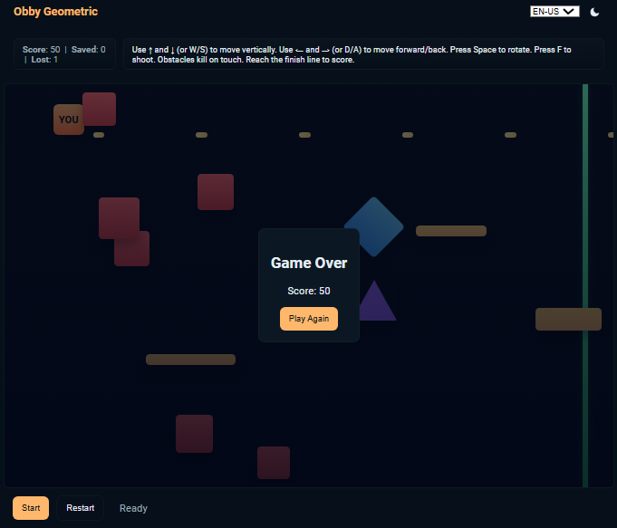

# Creating an Obby-style game on Roblox

Project developed during the "Game Developer Training: Roblox & Metaverse" bootcamp, under the guidance of expert [Leonardo Vasques](https://www.linkedin.com/in/leonardovasques/ "Leonardo Vasques").

## Technologies used

- **HTML5**,
- **CSS3**,
- **JavaScript** and
- **Lua**.

## Controls

- **Move vertically:** `↑` / `W` and `↓` / `S`  
- **Move horizontally:** `→` / `D` and `←` / `A`
- **Rotate:** `Space` (90° per press, small cooldown)  
- **Shoot:** `F`  
- **Start / Restart:** UI buttons

## Features

- **Responsive layout** using CSS variables and media queries.  
- **Dark / Light theme** toggle with moon/sun icons (dark default).  
- **Multilanguage** UI (EN-US default; PT-BR and ES-ES available).  
- **Obstacles**: geometric shapes (square, rectangle, diamond, triangle) with behaviors (rotate, oscillate, horizontal movement).  
- **Platforms**: safe floating platforms to create Obby-style challenges.  
- **HUD**: Score, Saved, Lost counters with `aria-live` updates.  
- **Accessibility**: keyboard controls, `tabindex`, `aria-*` attributes.

## Roblox integration notes

If you plan to port the idea to Roblox:

- Use **LocalScripts** for client input and UI, **Server Scripts** for authoritative obstacle spawning and projectile handling.  
- Keep visual assets (Parts, Meshes) in Workspace and group obstacles in folders.  
- Use **RemoteEvents** for client→server actions (move, rotate, fire).  
- The provided JavaScript logic can be used as a design reference for Lua scripts and game pacing.

## Customization tips

- Tweak `spawnInterval`, `obstacleSpeed` and platform positions in `script.js` to change difficulty.  
- Add sound effects for shooting, collisions and scoring.  
- Replace simple shapes with SVG or image assets for a different visual style.

[LICENSE](./LICENSE)
